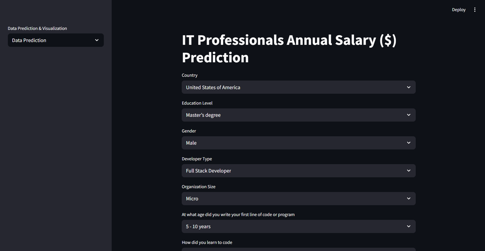
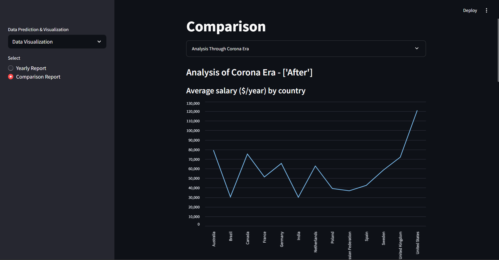
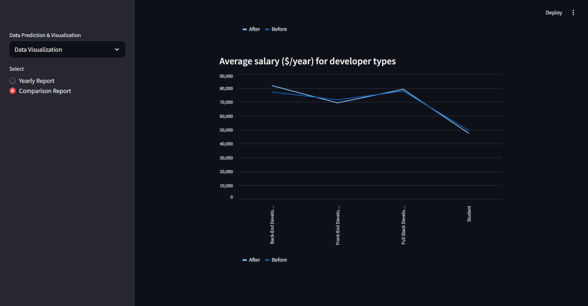
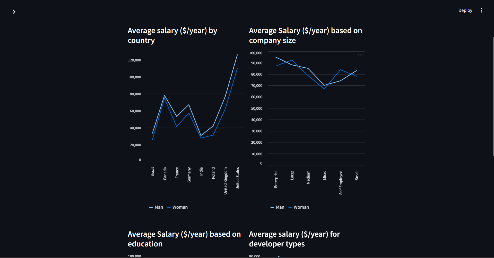
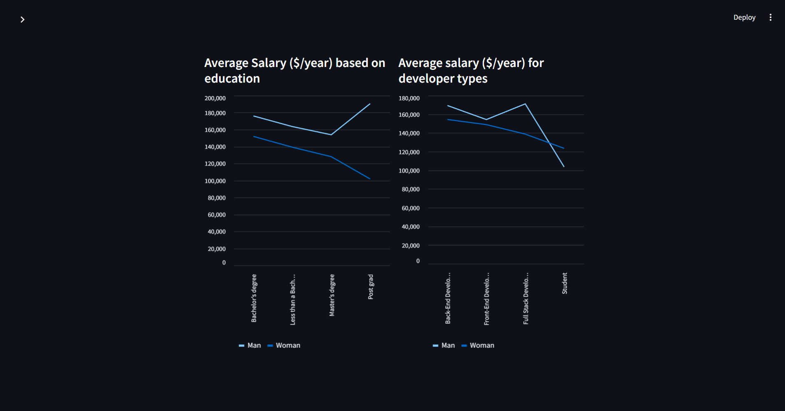
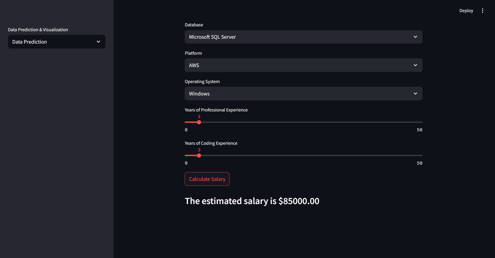

# Tech Employee Salary Prediction

Predictive modeling project that estimates tech employee salaries using Stack Overflow survey data from four consecutive years. The project leverages multiple machine learning models, performs comparative analysis, and integrates the best model into a real-time web app for salary prediction.

---

## Features

- Developed a predictive model for tech employee salaries using data from four consecutive years of Stack Overflow surveys.
- Implemented and compared multiple ML regression models:
  - Linear Regression
  - Decision Tree Regressor
  - Random Forest Regressor
  - Gradient Boosting Regressor
  - XGBoost Regressor
- Evaluated models using Mean Absolute Error (MAE), Mean Squared Error (MSE), and R² Score.
- Integrated the final model into a Streamlit app for real-time salary predictions.
- Created detailed salary trend visualizations with Matplotlib, analyzing the impact of the pandemic on tech salaries.
- Tools and libraries used: Python, Matplotlib, Numpy, Pandas, Pickle, Scikit-learn, Streamlit, Git, Jupyter Notebook.

---

## Folder Structure

├── data/ # CSV files for 4 years of salary data
├── salary_prediction.ipynb # Jupyter Notebook for exploratory data analysis and modeling
├── app.py # Streamlit app for real-time salary prediction
├── analysis.py # Code for salary trend visualization and analysis
├── my_function.py # Utility functions
├── predict.py # Prediction functions and model loading
├── report.py # Report generation code (if any)
├── requirements.txt # Project dependencies
├── saved_steps.joblib # Serialized trained model and preprocessing pipeline

---

## Screenshots

### Streamlit App - Real-time Prediction Interface  

---

## Installation

1. Clone the repository:

- git clone https://github.com/yourusername/tech-salary-prediction.git
- cd tech-salary-prediction

2. Create a virtual environment (optional but recommended):

- python -m venv venv
- source venv/bin/activate  # On Windows: venv\Scripts\activate

3. Install dependencies:

- pip install -r requirements.txt

4. Unzip the data folder for CSV data

## Usage

1. Run the Jupyter Notebook for EDA and Model Training
- jupyter notebook salary_prediction.ipynb

2. Run the Streamlit App for Real-time Predictions
- streamlit run app.py

## Model Training & Evaluation
- Models trained: Linear Regression, Decision Tree, Random Forest, Gradient Boosting, XGBoost.
- Hyperparameter tuning performed using Grid Search CV.
- Performance metrics (MAE, MSE, R²) compared to select the best model.
- The best model serialized as saved_steps.joblib for deploymen
